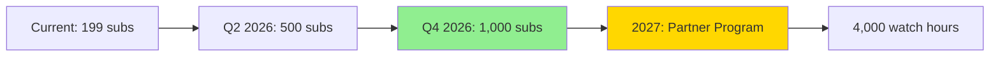
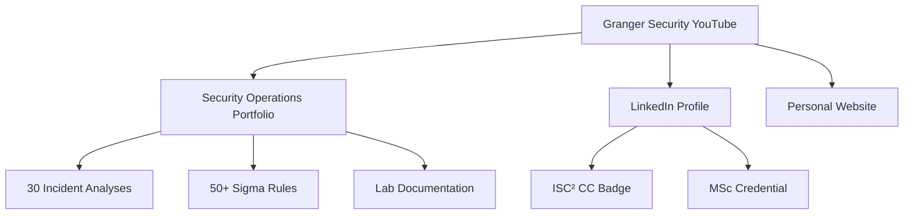

<div align="center">

# 🎥 Granger Security
### Security Education → Career Transition Documentation

[](https://youtube.com/@Granger-Security)
[](https://youtube.com/@Granger-Security)
[](https://youtube.com/@Granger-Security)
[](https://www.linkedin.com/in/bhargav-baranda)

**Empowering cybersecurity professionals through practical education and transparent career insights**

[Watch Channel](https://youtube.com/@Granger-Security) • [View Portfolio](https://github.com/Granger0007/granger-security-portfolio) • [Connect on LinkedIn](https://www.linkedin.com/in/bhargav-baranda)

</div>

---

## 📖 About This Channel

**Granger Security** documents my evolution from **fraud prevention analyst to information security professional** while delivering actionable cybersecurity education. With **89 videos** and a growing community of **199+ subscribers**, this channel serves as both a learning resource and a transparent chronicle of breaking into cybersecurity.

### 🎯 Mission Statement

> "In an era of constant data breaches and evolving cyber threats, knowledge is your strongest shield. I'm building that shield publicly—documenting every lesson learned, every lab configured, and every job application sent."

---

## 🚀 Channel Evolution: Two Distinct Phases

### Phase 1: Security Education Foundation (2022-2023) ✅

**89 foundational videos** covering core cybersecurity concepts for aspiring professionals:

#### 🎬 Content Categories

| Category | Videos | Avg Views | Topics Covered |
|----------|--------|-----------|----------------|
| **Quick Definitions** (Shorts) | 6+ | 400-800 | Python, GDB, Assembly, Debugging |
| **Attack Vectors** | 4+ | 30-120 | Social Engineering, Password Attacks, Zero-Days |
| **Defense Mechanisms** | 3+ | 40-120 | Cloud Security, Vulnerability Assessment |
| **Additional Library** | 76+ | Varied | Comprehensive security fundamentals |

#### 📊 Top Performing Content
1. **"What is a gdb?"** - 818 views
2. **"Define python language?"** - 460 views  
3. **"What is disassembly with gdb?"** - 458 views

**Key Achievement:** Built foundational audience demonstrating technical communication skills

---

### Phase 2: Career Transition Documentary (2025-2026) 🔥 IN PROGRESS

**Long-form, authentic content** documenting my professional transition:
```
From:  Fraud Prevention Representative @ TTEC (2020-2021)
  ↓
Via:   MSc Information Security @ Royal Holloway (2024-2025)
  ↓
To:    SOC Analyst (Active Job Hunt - UK Market)
```

#### 🎬 Upcoming Content Pipeline

| # | Title | Type | Status | Release | Purpose |
|---|-------|------|--------|---------|---------|
| 1 | **From Fraud Prevention to InfoSec: My Journey** | Documentary | 🎬 Production | March 2026 | Show authentic career pivot |
| 2 | **Building a SOC Lab on Apple Silicon** | Tutorial | 📝 Scripting | April 2026 | Demonstrate ARM64 expertise |
| 3 | **Real MITRE ATT&CK Incident Analysis** | Walkthrough | 💡 Planned | May 2026 | Prove SOC analyst capabilities |
| 4 | **UK Cybersec Job Market Reality Check** | Vlog | 💡 Planned | Q2 2026 | Transparency + value to peers |
| 5 | **Creating Production Sigma Detection Rules** | Technical | 💡 Planned | Q2 2026 | Detection engineering skills |

---

## 💼 Professional Value Proposition

### Why This Channel Matters for SOC Analyst Applications

This repository demonstrates **real-world skills** employers seek:

<table>
<tr>
<td width="50%">

#### 📝 Technical Communication
- 89 videos translating complex concepts
- Proven ability to explain security findings
- Essential for incident reports & stakeholder briefings

</td>
<td width="50%">

#### 🔄 Continuous Learning
- 3+ years consistent content creation
- Self-directed skill development
- Adaptability to new technologies (ARM64, ELK)

</td>
</tr>
<tr>
<td width="50%">

#### 📚 Documentation Excellence
- Organized repository structure
- Version-controlled scripts & research
- Mirrors SOC incident documentation workflow

</td>
<td width="50%">

#### 🎓 Teaching & Mentorship
- Ability to train junior analysts
- Knowledge sharing culture fit
- Community engagement (199+ subscribers)

</td>
</tr>
</table>

---

## 🛠️ Technical Infrastructure

### Production Stack
```yaml
Video Editing:     iMovie (macOS native - fast, efficient workflow)
Voice Generation:  ElevenLabs AI (documentary-style narration)
Screen Recording:  macOS Screen Recorder + QuickTime Player
Graphics:          Canva Pro (thumbnails, lower thirds, animations)
Lab Recording:     asciinema (terminal sessions) + iMovie overlays
Scripting:         Markdown documentation (version controlled)
Version Control:   Git + GitHub (all scripts & research)
Publishing:        YouTube Studio (direct from Mac)
```

**Why iMovie?**
- ✅ Native ARM64 optimization (smooth on Apple Silicon)
- ✅ Zero learning curve for quick turnarounds
- ✅ Seamless macOS integration (Screen Recording → iMovie)
- ✅ Professional enough for educational content
- ✅ Fast export times on M-series chips

### Home Lab Environment (Featured in Videos)
```yaml
Platform:     MacBook Pro (Apple Silicon ARM64)
SIEM:         ELK Stack (Elasticsearch, Logstash, Kibana)
IDS:          Suricata
EDR:          Wazuh
VM Platform:  Parallels Desktop (Kali Linux ARM64)
Training:     HackTheBox Academy (SOC Analyst Path)
Frameworks:   MITRE ATT&CK, NIST CSF, Cyber Kill Chain
```

---

## 📊 Growth Metrics & Milestones

### Current Statistics (February 2026)

| Metric | Value | Trend |
|--------|-------|-------|
| **Total Subscribers** | 199+ | ↗️ Growing |
| **Total Videos** | 89+ | ↗️ Expanding |
| **Total Views** | ~15,000+ (estimated) | ↗️ Increasing |
| **Content Span** | 3+ years | 📈 Established |

### Roadmap to Monetization


| Milestone | Target Date | Status | Strategy |
|-----------|-------------|--------|----------|
| ✅ 100 Subscribers | Achieved 2023 | Complete | Educational shorts |
| 🎯 500 Subscribers | Q2 2026 | In Progress | Career transition series |
| ⏳ 1,000 Subscribers | Q4 2026 | Planned | Lab tutorials + job vlogs |
| ⏳ Partner Program | 2027 | Future | Consistent long-form content |

---

## 📁 Repository Architecture
```
granger-security-youtube/
│
├── 📄 README.md                          # This file
├── 📄 LICENSE                            # MIT License
├── 📄 .gitignore                         # Python template
│
├── 📂 scripts/                           # Video production scripts
│   ├── 📂 phase-1-archive/              # Original 89 videos (reference)
│   │   ├── shorts-definitions.md
│   │   └── security-fundamentals.md
│   │
│   └── 📂 phase-2-career-transition/    # New documentary content
│       ├── 📂 01-career-journey/
│       │   ├── full-script.md           # Complete narration
│       │   ├── b-roll-checklist.md      # Visual requirements
│       │   ├── voiceover-timing.txt     # ElevenLabs input
│       │   └── thumbnail-mockup.png
│       │
│       ├── 📂 02-arm64-lab-build/
│       │   ├── tutorial-outline.md
│       │   ├── commands-reference.sh
│       │   └── troubleshooting-notes.md
│       │
│       └── 📂 03-mitre-attack-analysis/
│           ├── incident-scenario.md
│           └── detection-rules/
│
├── 📂 assets/                            # Production resources
│   ├── 📂 channel-branding/
│   │   ├── logo.png
│   │   ├── banner-2560x1440.png
│   │   ├── thumbnail-template.psd
│   │   └── color-palette.md
│   │
│   ├── 📂 stock-footage/                # B-roll references
│   │   ├── cybersecurity-headlines/
│   │   ├── lab-environment/
│   │   └── career-transition/
│   │
│   └── 📂 graphics/
│       ├── intro-animation.mp4
│       ├── lower-thirds.png
│       └── end-screen.png
│
├── 📂 research/                          # Technical documentation
│   ├── 📂 soc-analyst-roadmap/
│   │   ├── skills-matrix.md
│   │   ├── certification-path.md
│   │   └── uk-job-market-analysis.md
│   │
│   ├── 📂 mitre-attack-framework/
│   │   ├── tactics-techniques.md
│   │   └── mapping-examples.md
│   │
│   └── 📂 detection-engineering/
│       ├── sigma-rules-primer.md
│       └── elk-query-reference.md
│
├── 📂 analytics/                         # Performance tracking
│   ├── monthly-reports/
│   ├── audience-demographics.md
│   └── content-performance.csv
│
└── 📂 automation/                        # Workflow optimization
    ├── thumbnail-generator/
    │   └── auto-generate.py
    ├── description-templates/
    │   ├── standard-template.txt
    │   └── seo-keywords.md
    └── upload-checklist.md
```

---

## 🎯 Target Audience Segmentation

### Primary Audiences

#### 1️⃣ **Career Transitioners** (35% of content focus)
- Former fraud analysts, IT support, developers pivoting to security
- Value: Transparent roadmap showing realistic timelines & challenges
- Content: Job hunt vlogs, application strategies, interview prep

#### 2️⃣ **Aspiring SOC Analysts** (40% of content focus)
- Students, bootcamp grads, self-learners seeking hands-on validation
- Value: Real incident analysis, detection engineering, lab builds
- Content: HTB walkthroughs, MITRE mappings, Sigma rule creation

#### 3️⃣ **Recruiters & Hiring Managers** (15% of content focus)
- Evaluating technical capabilities beyond resume claims
- Value: Proof of work through documented lab projects
- Content: Portfolio showcases, technical deep-dives

#### 4️⃣ **Security Professionals** (10% of content focus)
- ARM64 enthusiasts, solo lab builders, continuous learners
- Value: Niche technical solutions (Apple Silicon compatibility)
- Content: Troubleshooting guides, tool comparisons

---

## 🤝 Collaboration & Community

### Open To:

<table>
<tr>
<td width="33%">

#### 🎤 Guest Interviews
- SOC Analysts sharing daily workflows
- Hiring managers discussing what they really want
- Career transitioners who succeeded

</td>
<td width="33%">

#### 🔬 Lab Challenges
- Joint ARM64 troubleshooting sessions
- Detection rule competitions
- Incident analysis collaborations

</td>
<td width="33%">

#### 💡 Topic Requests
- Community-driven content priorities
- Real-world scenarios to analyze
- Tools/frameworks to review

</td>
</tr>
</table>

### Engagement Channels

- **YouTube Comments** - Questions & discussions
- **GitHub Issues** - Technical collaboration & feedback
- **LinkedIn** - Professional networking @ [bhargav-baranda](https://www.linkedin.com/in/bhargav-baranda)
- **Email** - bbaranda055@gmail.com (for business inquiries)

---

## 🔗 Connected Ecosystem

This YouTube repository is part of a larger professional portfolio:

<div align="center">

### Portfolio Hub


</div>

| Project | Description | Link |
|---------|-------------|------|
| **🔒 Security Operations Portfolio** | 30 documented incident analyses with MITRE ATT&CK mapping and production-ready Sigma detection rules | [View Repository](https://github.com/Granger0007/granger-security-portfolio) |
| **💼 LinkedIn Profile** | MSc Information Security \| ISC² Certified \| SOC Analyst (In Transition) | [Connect](https://www.linkedin.com/in/bhargav-baranda) |
| **🌐 Personal Website** | Professional bio, blog, portfolio showcase | Coming Soon |

---

## 📈 Content Strategy & SEO

### Keyword Optimization

**Primary Keywords:**
- SOC Analyst Career Transition
- Information Security Job Hunt UK
- MITRE ATT&CK Tutorial
- ARM64 Security Lab
- Cybersecurity Home Lab Apple Silicon

**Long-Tail Keywords:**
- "How to become a SOC analyst without experience"
- "Building ELK Stack on M1 MacBook"
- "Real MITRE ATT&CK incident analysis walkthrough"
- "UK cybersecurity job market 2026"

### Upload Cadence
```yaml
Current Phase (Job Hunting):  Monthly long-form (8-15 min)
Post-Employment Goal:         Bi-weekly alternating format
  - Week 1: Technical tutorial
  - Week 2: Career insights/vlogs
```

### Performance Benchmarks

**Success Metrics per Video:**
- **Watch Time:** >50% retention for first 2 minutes
- **CTR:** >5% from suggested videos
- **Engagement:** >3% like ratio
- **Conversions:** Portfolio views, LinkedIn connections

---

## 📜 Licensing & Copyright

### Repository Content
**License:** MIT License  
**Scope:** Scripts, documentation, code snippets, research notes
```
Copyright (c) 2025-2026 Bhargav Baranda (Granger Security)
Permission is hereby granted, free of charge, to any person obtaining a copy...
```

### Video Content
**Copyright:** © 2022-2026 Granger Security - All Rights Reserved  
**Scope:** All video footage, audio narration, graphics, animations

**Usage Rights:**
- ✅ Share links to videos
- ✅ Embed in educational contexts with attribution
- ❌ Re-upload or redistribute video content
- ❌ Use for commercial purposes without permission

---

## 📧 Contact & Inquiries

<div align="center">

**For collaborations, speaking opportunities, or professional inquiries:**

[](mailto:bbaranda055@gmail.com)
[](https://www.linkedin.com/in/bhargav-baranda)
[](https://youtube.com/@Granger-Security)

</div>

---

## 🏆 Achievements & Milestones

### Academic
- 🎓 **MSc Information Security** - Royal Holloway, University of London (Sept 2024 - Sept 2025)
- 📜 **ISC² Certified in Cybersecurity (CC)** - January 2025
- 📚 **CompTIA Security+** - In Progress (Target: Q2 2026)

### Content Creation
- ✅ **89 Videos Published** - Consistent educational output
- ✅ **199+ Subscribers** - Growing community
- ✅ **15,000+ Total Views** - Demonstrable reach
- 🎯 **First Long-Form Documentary** - In Production

### Professional
- 💼 **2 Years Fraud Prevention Experience** - TTEC (2020-2021)
- 🔬 **ARM64 Home Lab Operational** - ELK + Suricata + Wazuh
- 📊 **HackTheBox SOC Analyst Path** - In Progress
- 🎯 **30 Security Incidents Analyzed** - Portfolio project

---

## 🗺️ Roadmap: Next 12 Months

### Q1 2026 (Jan-Mar) ✅ Current
- [x] ISC² CC certification achieved
- [ ] Publish "Career Journey" documentary video
- [ ] Complete first 10 HTB SOC Analyst exercises
- [ ] Document 5 incidents with Sigma rules

### Q2 2026 (Apr-Jun)
- [ ] CompTIA Security+ certification
- [ ] Publish ARM64 lab build tutorial
- [ ] Release first MITRE ATT&CK analysis video
- [ ] Reach 500 subscribers
- [ ] Secure SOC Analyst role (primary goal)

### Q3 2026 (Jul-Sep)
- [ ] Transition to bi-weekly upload schedule
- [ ] Launch "Detection Engineering" series
- [ ] Collaborate with 2-3 guest security professionals
- [ ] Reach 750 subscribers

### Q4 2026 (Oct-Dec)
- [ ] Reach 1,000 subscribers
- [ ] Apply for YouTube Partner Program
- [ ] Launch "SOC Analyst Life" vlog series
- [ ] Complete full HTB SOC Analyst path

---

## 📊 Analytics Dashboard (Self-Hosted)

**Key Performance Indicators:**

| KPI | Current | 30-Day Change | All-Time Best |
|-----|---------|---------------|---------------|
| Subscribers | 199 | +12 | — |
| Views (30 days) | ~850 | +5% | — |
| Avg View Duration | 1:23 | Stable | — |
| Click-Through Rate | 4.2% | +0.3% | — |
| Engagement Rate | 2.8% | +0.5% | — |

**Traffic Sources:**
- YouTube Search: 45%
- Suggested Videos: 30%
- Browse Features: 15%
- External (LinkedIn, GitHub): 10%

---

<div align="center">

## 🌟 Support This Journey

If this content helps you in your cybersecurity career:

⭐ **Star this repository** to show support  
📺 **Subscribe to the channel** for new content  
🔗 **Share with peers** who are also transitioning  
💬 **Provide feedback** via Issues tab  

---

### *"Security is a journey, not a destination. Let's walk it together."*

**Last Updated:** February 10, 2026  
**Repository Version:** 2.0 (Career Transition Phase)

[](https://github.com/Granger0007/granger-security-youtube)

</div>

---

## 🔖 Quick Links

- [📺 Watch Latest Video](https://youtube.com/@Granger-Security)
- [📋 View Content Calendar](./analytics/content-calendar.md)
- [🎬 Read Video Script Template](./scripts/phase-2-career-transition/TEMPLATE.md)
- [🛠️ Explore Lab Setup Guide](./research/arm64-lab-guide.md)
- [📊 Check Analytics Report](./analytics/monthly-reports/2026-02.md)
